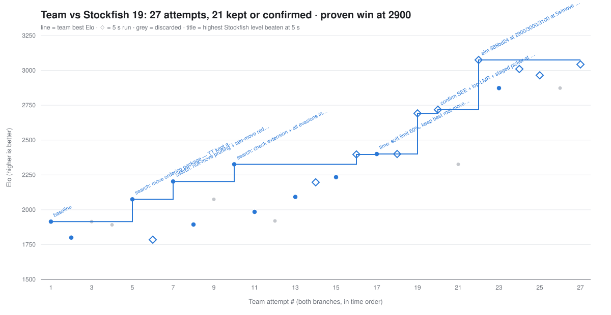

# chess-winning-team

A chess engine built to beat Stockfish at the highest possible Elo, with at most 5 seconds of thinking per move (draws don't count). Competition rules: [`docs/Competition-instructions.md`](docs/Competition-instructions.md). Research loop: [`program.md`](program.md).

Two people work on this repo, one on macOS and one on Windows, each on their own `autoresearch/<tag>` branch in their own git worktree. `main` holds the shared, read-only harness.

## Progress

<!-- progress:start -->


| Run | Host | Experiments | Kept | Best Elo (0.25 s) | Best FULL Elo (5 s) | Target | Wins@target (FULL) | Proofs |
|---|---|---|---|---|---|---|---|---|
| — | — | 0 | 0 | — | — | — | — | — |

Elo is only comparable within one host (the Mac and the Windows PC reach different depths). Rebuilt from the git log by `python tools/progress.py`.
<!-- progress:end -->

## Layout

| Path | What | Who edits it |
|---|---|---|
| `engine/` | The player: a Rust UCI engine (`cargo build --release` → `engine/target/release/engine`). `src/main.rs` UCI, `src/search.rs`, `src/eval.rs`. `vendor/` holds the one dependency ([cozy-chess](https://github.com/analog-hors/cozy-chess), MIT, move generation) so builds are offline. | the research loop |
| `arena/util.py` | Fixed constants, Stockfish setup, match harness, PGN + per-move logging, Elo estimate, **integrity checks** | nobody (read-only) |
| `arena/bench.py` | `make bench` / `make bench-full` entry point | nobody |
| `arena/analyze.py` | `make analyze RUN=...`: full-strength Stockfish annotation → `analysis/<run>/summary.md` | nobody |
| `arena/app.py` + `app/` | `make app`: replay any saved game on a graphical board | nobody |
| `openings.epd` | 24 balanced opening positions the arena plays from | nobody |
| `Makefile` | `engine`, `bench`, `bench-full`, `profile`, `analyze`, `app`, `test` | nobody |
| `games/runs/<commit>/` | Every game of every run: `game_NN.pgn`, `moves.jsonl`, `summary.json/.txt` | written by the arena, never deleted |
| `games/proofs/` | `beat-<elo>.pgn`: the wins that raised `TARGET_ELO` | copied by the loop |
| `analysis/<commit>/` | `summary.md`, annotated PGNs, `grandmaster.md`, `engine-dev.md` | the analysis skill |
| `.claude/skills/analyze-game/` | The post-game analysis skill (Stockfish annotation + two sub-agents) | — |
| `tools/stockfish.py` | Downloads and locates the pinned Stockfish | — |
| `tools/progress.py` | Rebuilds `progress.svg` (Elo over time) and the Progress scoreboard above from the git log of every `autoresearch/*` branch | — |
| `tools/evidence.py` | Collects the games behind every `[keep]`/`[FULL]`/`[ladder]` claim into `evidence/`, replays them and recomputes each Elo | — |
| `evidence/` | The games that back every claimed Elo and every beaten level, with a verified table (`evidence/README.md`) | regenerated on main after every claim |
| `progress.svg` | The Elo-over-time chart | regenerated by the loop after every experiment |

## Engine language

**Rust**, per [`docs/language_research.md`](docs/language_research.md). The baseline engine is deliberately small: iterative deepening, alpha-beta with MVV-LVA ordering, quiescence search, material + piece-square evaluation, repetition/50-move detection, a simple time manager. Everything else (transposition table, PVS, null move, LMR, killers/history, tapered eval, king safety, NNUE, …) is an experiment for the loop.

## Setup

1. **Rust** — [rustup](https://rustup.rs). macOS: `rustup-init` (needs Xcode command line tools). Windows: `winget install Rustlang.Rustup`; if you do not have the MSVC C++ build tools, use the self-contained GNU toolchain instead: `rustup toolchain install stable-x86_64-pc-windows-gnu && rustup default stable-x86_64-pc-windows-gnu`.
2. **make** — macOS: comes with the command line tools. Windows: `winget install GnuWin32.Make` and add `C:\Program Files (x86)\GnuWin32\bin` to `PATH`. Run everything from **Git Bash** on Windows.
3. **Python 3.11+** with `python -m pip install python-chess`.
4. **Stockfish 19**: `python tools/stockfish.py` (see below).
5. Check: `make engine && make profile` prints a nodes/s line; `python arena/bench.py --games 2 --workers 2 --out /tmp/smoke` plays two quick games (smoke test only; not a valid experiment).

## Running experiments

```
make bench                        # 30 games at 0.25 s/move, ~3-5 min, prints the run summary
make bench-full                   # 30 games at 5 s/move, the real rule, ~1 h
make analyze RUN=games/runs/<commit>/   # Stockfish annotation → analysis/<commit>/summary.md
make app                          # replay UI at http://127.0.0.1:8000
make profile [DEPTH=7]            # fixed-position nodes/s
SEED=1 make bench                 # rotate the opening set (a near-miss may be re-run once)
WORKERS=2 make bench              # parallel games (default: min(4, cores/4))
```

Each run plays `NUM_GAMES` games against Stockfish at `TARGET_ELO - LADDER_STEP`, `TARGET_ELO` and `TARGET_ELO + LADDER_STEP`, every opening from both colours at the same level. `elo` is a performance rating anchored to Stockfish's `UCI_Elo` scale and `elo_err95` is its honest 95% half-width — with 30 games it is wide, which is why the keep rule needs `ELO_KEEP_MARGIN` and why `make bench-full` confirms every few keeps. Only compare runs from the same machine.

The integrity checks in `arena/util.py` run on every game: time compliance (`TIME_TOLERANCE_S` grace), legal play, a self-contained engine (no child processes, no network, no files outside `engine/`, checked statically and at run time), and saved games with the required PGN headers. A failing check crashes the run.

## Stockfish (opponent)

**Pinned version: Stockfish 19** (release `sf_19`). Both machines must run the same build, because `UCI_Elo` levels differ between Stockfish versions and results from the two branches would otherwise not be comparable.

Install it (macOS, or Git Bash on Windows):

```
python tools/stockfish.py
```

This downloads the official release for your OS into `tools/stockfish/` (gitignored, ~80 MB), verifies its SHA-256 and checks that it reports version 19. The binary is never committed.

The arena finds Stockfish with `find_stockfish()` in [`tools/stockfish.py`](tools/stockfish.py), in this order:

1. the `STOCKFISH_PATH` environment variable
2. `tools/stockfish/stockfish` (`stockfish.exe` on Windows)
3. `stockfish` on `PATH`

Any binary that isn't version 19 is rejected. To bump the version, update `STOCKFISH_VERSION`, `RELEASE_TAG` and the checksums in `ASSETS` together, in one commit on `main`.

Stockfish is the opponent (`UCI_LimitStrength` + `UCI_Elo`, 1320–3190) and, at full strength, the post-game analysis tool. It is never part of the player.
