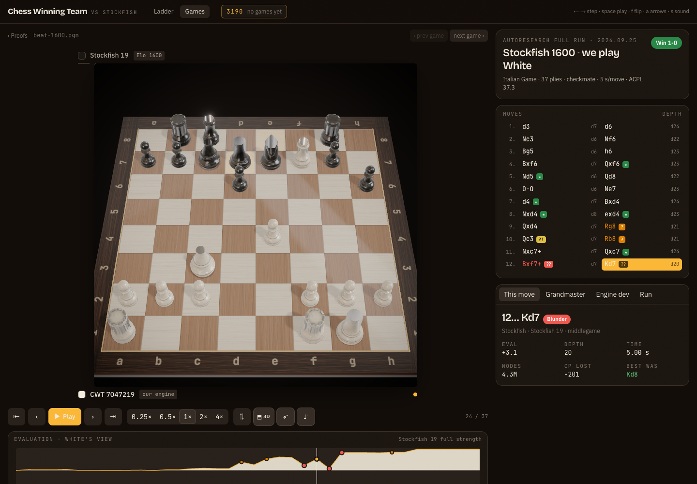

# Frontend

The replay and results app the judges see. Built from `docs/frontend_research.md`: Vite + React 19 + TypeScript,
Tailwind v4, Motion, lichess **chessground** for the board. Data comes from the JSON API in `arena/app.py`, which reads
`games/`, `analysis/` and `evidence/` straight from the repo, so nothing is duplicated.

```sh
make app-build   # npm install + vite build  ->  frontend/dist
make app         # serves frontend/dist (or the old app/ page if there is no build) on http://127.0.0.1:8000
```

Development: `make app` in one terminal (the API), `cd frontend && npm run dev` in another (Vite on :5173 proxies `/api`).

## Screens

| Route | What |
|---|---|
| `#/` | **Ladder**: highest Stockfish Elo beaten as the hero number, every rung with W/D/L at 5 s (and fast runs), status, link to the proof game. |
| `#/library/<run>` | **Games**: every run (newest first, proofs pinned) and its games with result, ACPL, blunders. |
| `#/replay/<run>/<file>[/<ply>]` | **Replay**: chessground board with piece animation, last move + check, blunder/mistake badges on the square and the move list, played-vs-best arrows, spring eval bar, eval graph (hover scrubs, click jumps, blunder dots), depth per move, transport bar with 0.25×–4× autoplay whose pace slows around big swings, flip, synthesised sounds, confetti on a win, commentary card with the move's depth/time/nodes/cp-loss and the grandmaster / engine-dev / run reports. |

Keyboard: `←`/`→` step, `Home`/`End`, `space` play, `f` flip, `a` arrows, `s` sound, `v` 3D toggle, `t` top view (3D only).

## 3D board



A toggle turns the flat chessground board into "Studio Set": a photoreal marble chess set (Poly Haven, CC0) on a
walnut board under a studio HDRI, rendered with React Three Fiber. The 2D board is the default and stays fully
functional; 3D is opt-in and never blocks the demo.

**Keys / controls**

| Key | Effect |
|---|---|
| `v` | Toggle 2D ⇄ 3D (also the `⬒ 3D` pill button in the transport bar) |
| `t` | Top-down view (3D only) |
| `f` | Swing the camera 180° to the other side (works in both 2D and 3D) |
| double-click the board | Reset the camera to the default ~55° pose (3D only) |

Toggling is seamless in both directions: the 2D board stays mounted underneath the canvas and crossfades out only
once the 3D scene has rendered its first frame (220 ms), and toggling back reverses it — the camera rises to
top-down before the 2D board fades back in. Under `prefers-reduced-motion` every crossfade, fly-in and tween becomes
an instant cut.

**Flags and persistence**

- `?view=3d` / `?view=2d` in the URL forces the initial view; otherwise the last choice (`localStorage`) is used,
  falling back to 2D. The choice persists across games and reloads.
- `?gl=high` / `?gl=low` forces the render tier; otherwise the app starts on `high` and drops to `low` automatically
  on a software/CPU renderer (e.g. `swiftshader`, `llvmpipe`) or if the frame rate declines while animating. The
  drop is one-way. `high` adds MSAA, bloom/vignette/AGX tone mapping and a reflective floor; `low` drops the
  post-processing composer and uses a matte floor, at up to a 2048→1024 shadow-map and 1.75→1 device-pixel-ratio
  saving.
- The 3D button is disabled (with an explanatory title) when the browser has no WebGL2. A lost GPU context, or any
  error while the 3D scene renders, falls back to the 2D board automatically with a 4-second toast.

**Performance**

The 3D canvas uses `frameloop="demand"`: it renders a frame only when the replay store changes, an animation (a
piece tween, a camera move, a pulsing highlight) is in flight, or drei's `CameraControls` is settling — never on an
idle timer. Paused with nothing animating, the GPU is fully idle. The three/fiber/drei/postprocessing bundle
(~1.2 MB) and the piece/board assets (a ~1.3 MB glTF, a 1.6 MB HDRI) are only fetched the first time 3D is used —
either on the first toggle or, sooner, when the pointer hovers the 3D button — so the default 2D experience and its
bundle are unaffected.

**Offline**

The whole app, 3D included, works with no network access: fonts are self-hosted (`@fontsource*` packages, no Google
Fonts `<link>`), and the chess set / HDRI / textures ship under `public/models` and `public/hdri` rather than being
fetched from a CDN at runtime.

**Credits**

Chess set by Riley Queen and the `studio_small_09` HDRI by Poly Haven, both CC0 — see
`public/models/CREDITS.txt`. https://polyhaven.com/license

## Layout

```
src/lib/api.ts        typed API client (runs, games, game, ladder)
src/lib/chess.ts      eval helpers, move judgement thresholds (≥200 blunder, ≥100 mistake, ≥50 inaccuracy)
src/lib/sound.ts      WebAudio move/capture/check/result sounds (no assets to license)
src/lib/router.ts     hash router
src/lib/three/        3D world conventions, URL flags/tier, tween timings, palette, animation registry
src/store/replay.ts   zustand store: game, ply, playing, speed, orientation, view (2d/3d)…
src/components/       Board, EvalBar, EvalGraph, MoveList, Transport, Commentary, Markdown, BoardSwitch
src/components/three/ the "Studio Set" 3D board (Board3D, Scene, Studio, BoardMesh, Pieces, CameraRig, …)
src/views/            Ladder, Library, Replay
src/styles/index.css  design tokens (OKLCH, dark-first), chessground theme, report prose
```

## Next (from the research doc's plan)

1. Cinematic auto-replay: camera drift, caption bar from the analysis comments.
2. Share card (html-to-image), engine stat sparklines on the ladder, hall of fame.
